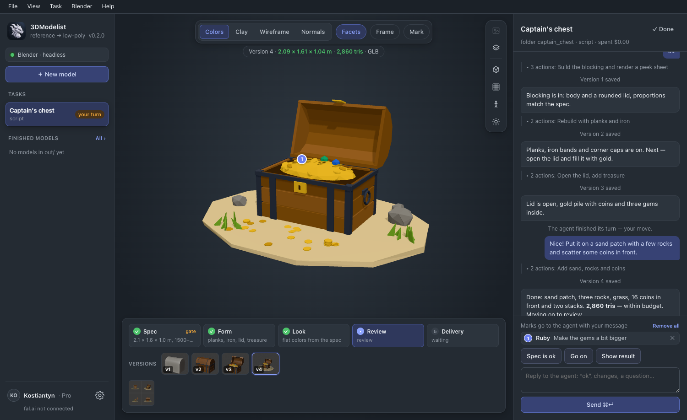

# 3DModelist

**Drop in a reference picture — get a low-poly 3D model back.**

[Русская версия](README.ru.md) · [MIT License](LICENSE)



3DModelist is a desktop studio that turns a reference image into a clean,
game-ready low-poly model. A Claude agent builds the model in Blender, stage by
stage, while you watch: the spec, the blocking, the frames it renders, the
files it exports. You answer in a chat when it asks — "ok", or what to change.

It is an open, local alternative to hosted "image to 3D" services. You bring
your own Claude account and, if you want, your own generator key — so a prop
built by script costs nothing beyond your Claude subscription, and a character
through a generator costs what the generator charges ($0.2–1.1), not a credit
bundle.

## Two ways to get the shape

| Route | Best for | Cost |
|---|---|---|
| **Agent by script** | rooms, furniture, props, crates, rocks, anything you can describe with dimensions | included in your Claude plan (or API tokens) |
| **Generator** | characters and organic shapes — Tripo P2 (clean quad mesh), Trellis 2, Hunyuan 3.1 | paid per run on [fal.ai](https://fal.ai), price shown on the button |

Either way the agent takes it from there: scale in real meters, the model on
the floor, flat matte materials from the reference palette, a check against the
reference from four angles, and export to `.blend` + GLB.

## What you see

- **The model** in the middle — orbit it, switch between colors, grey clay,
  and clay with wireframe. Everything is shown matte: gloss on flat facets
  reads as a defect.
- **Stages** at the bottom: spec → form → look → review → delivery, with
  timers and the agent's notes.
- **Frames** the agent renders after every change, as they appear.
- **Live model and versions.** Every time the agent reruns its scene script,
  the studio exports a quick snapshot from Blender: the model shows up in 3D
  while it is being built, and each step stays as a version (v1, v2…). Open
  any version from the same camera angle, or ask the agent to restore it.
- **Marks on the model.** Press **Mark** (M), click a part — it is highlighted
  under the cursor — and type what to fix. Marks go to the agent with your next
  message: the part's name, the point in Blender coordinates and a snapshot of
  the view with numbered marks.
- **Check tools** on the right of the view: the task's reference floating over
  the model (drag, resize, zoom, fade it to overlay), model parts (hide, select,
  double-click to frame), views that match the agent's sheet (front, back,
  sides, top, 3/4), a floor grid in meters, a 1.8 m person for scale, light
  strength and rotation, and a **Normals** view where flipped faces turn red.
- **Numbers against the spec**: size (width × depth × height, as in Blender) and
  triangles above the model turn green when they match the spec and orange when
  they don't.
- **The chat** with the agent on the right. It stops at the spec and waits for
  your "ok"; after that it shows frames and keeps going until you say stop.
- **Your choice of agents** per task: the modeler (Fable, Opus or Sonnet —
  "always the latest", a specific version, or any model name you type), how
  hard it thinks, and an optional reviewer (any of them, Haiku included) that
  looks at the renders with fresh eyes before delivery. With an API key the
  list of versions is fetched from Anthropic, so new models show up on their own.
- **Your language**: English, Deutsch, Français, Nederlands, Español,
  Українська, Русский — switched on the fly. The agent answers in the language
  you write to it.
- **Light, dark or system theme**, and an interface size slider (80–140%).

## Requirements

| What | Why | Where to get it |
|---|---|---|
| **Claude Code** (`claude` CLI) | the agent itself | [install guide](https://docs.claude.com/en/docs/claude-code/setup) |
| a **Claude subscription** (Pro / Max) *or* an **Anthropic API key** | pays for the agent | sign in with `claude` → `/login`, or [console.anthropic.com](https://console.anthropic.com/settings/keys) |
| **Blender** 4.2 or newer — for the script route | where the agent builds the model (runs headless) | [blender.org](https://www.blender.org/download/) |
| **Python 3** | the agent's helper tools | preinstalled on macOS (`xcode-select --install` if missing) |
| a **fal.ai key** — optional | only for the Generator route | [fal.ai/dashboard/keys](https://fal.ai/dashboard/keys) |

No Blender add-on is needed, and you never have to open Blender yourself:
3DModelist starts it headless with its own small server script when the agent
needs it. If you already use the official Blender Lab MCP add-on, that works
too — the protocol is the same.

## Download

Builds for macOS (Apple Silicon) are attached to each
[release](https://github.com/unibronga/3DModelist/releases). The app is not
signed, so macOS asks for confirmation on first launch: right-click the app →
**Open** → **Open**.

## First launch

A welcome window walks you through setup, one step at a time:

1. **Workspace** — a folder for references, scene scripts, models and renders.
   *Prepare folder* lays out the pipeline kit the agent works with (see below).
   You can pick a folder you already use: missing files are added, nothing is
   overwritten.
2. **Claude** — *By subscription* uses the login of your `claude` CLI (the app
   can open Terminal with `claude` for you to `/login`); *By API key* bills your
   Anthropic account per token, and each task shows what it cost.
3. **Blender** — optional. It is where the agent builds models by script. You
   never need its window: 3DModelist starts Blender headless when the agent
   begins work and shuts it down when you quit. Skip it if you only use
   generators — they return a finished model file.
4. **Generators** — optional fal.ai key, checked without spending anything.

Everything can be changed later in **Settings** (bottom left). Keys stay on
your machine, in `~/Library/Application Support/3DModelist/settings.json`
(readable only by you). The page never receives them back — only "set, …abcd".

## Run from source

You need [Node.js](https://nodejs.org/) 20 or newer.

```bash
git clone https://github.com/unibronga/3DModelist.git
cd 3DModelist
npm install
npm start            # builds the page and serves it at http://127.0.0.1:8770
```

Other commands:

```bash
npm run desktop      # the same inside an app window
npm run dev          # page with hot reload on :5274 (run `npm run server` alongside)
npm run dist         # macOS installer (.dmg) into release/
npm run icon         # rebuild the app icon from build/icon-source.png
npm run i18n         # check that all seven dictionaries have the same keys
```

## How it works

```
page (three.js) ──► local server (Node, no deps) ──► claude -p   ← the agent, one process per turn
                           │                              │
                           │                              └──► tools/bl ──► TCP :9876 ──► Blender
                           ├──► fal.ai queue (generators, only on your click)
                           └──► workspace/  refs · scenes · models · renders · out · runs
```

- **One turn = one process.** The agent runs as `claude -p` in the workspace.
  When it stops — at the spec gate, with a question, or done — your reply
  resumes the same session, so it remembers the whole task.
- **The pipeline kit** (`kit/`) is what makes a folder a workspace:
  `CLAUDE.md` with the rules, seven skills (reference → spec, modeling, look,
  review, export, Blender session, generators) with their lessons learned,
  `lib/artist.py` — a library of Blender helpers (primitives, props, cameras,
  contact sheets, export), the Blender bridge and the server script.
- **Generators are never run by the agent.** A paid run happens only when you
  press the button with the price on it; the request id is saved at once, so
  a restart waits for the same run instead of paying twice.
- The agent's environment is built from a whitelist: a stray
  `ANTHROPIC_API_KEY` or proxy variable from your terminal cannot silently
  change who pays.

## Project layout

```
server/        local server: tasks, agent runner, live model versions, fal.ai, Blender, settings
src/           the page: viewer (three.js), marks, task form, chat, settings
electron/      desktop shell — starts the server and shows its page
kit/           pipeline kit copied into a workspace
scripts/       icon preparation
build/         app icon
```

## Status

Early, and used in production by its author for low-poly interiors and level
props. macOS is the tested platform.

## License

[MIT](LICENSE)
