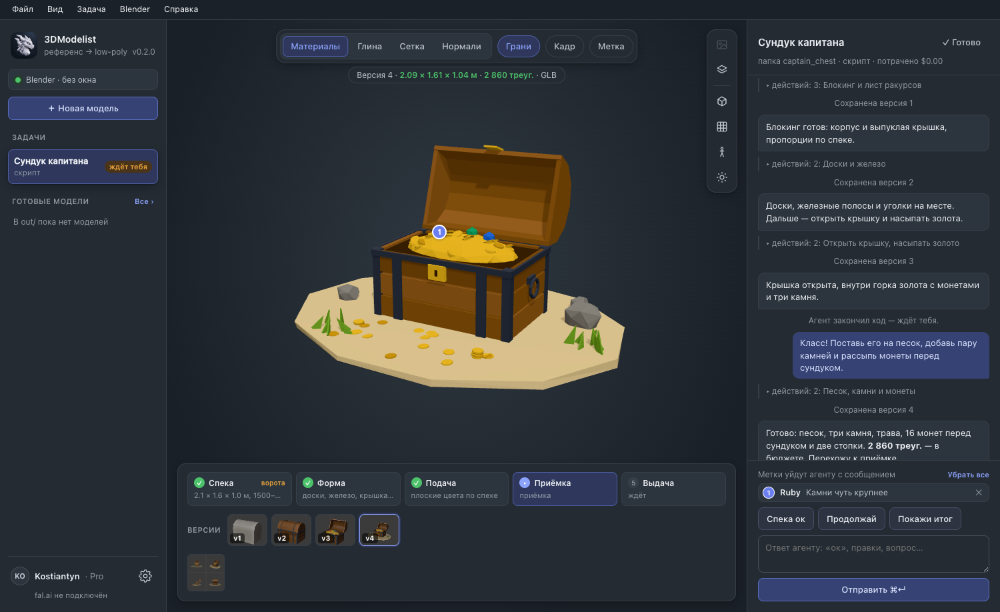

# 3DModelist

**Кидаешь референс — получаешь low-poly 3D-модель.**

[English version](README.md) · [Лицензия MIT](LICENSE)



3DModelist — настольная студия, которая превращает картинку-референс в чистую
low-poly модель для игры. Модель строит агент Claude в Blender, по этапам, и
всё видно по ходу: спека, форма, кадры, которые он снимает, файлы на выдаче.
Когда агент спрашивает, отвечаешь в чате: «ок» или что поправить.

Это открытая локальная замена облачным сервисам «картинка в 3D». Аккаунт
Claude и ключ генератора — свои, поэтому пропс, собранный скриптом, ничего не
стоит сверх подписки Claude, а персонаж через генератор стоит ровно столько,
сколько берёт генератор ($0.2–1.1), а не пакет кредитов.

## Два пути к форме

| Путь | Для чего | Цена |
|---|---|---|
| **Агент скриптом** | комнаты, мебель, пропсы, ящики, камни — всё, что описывается размерами | входит в план Claude (или токены API) |
| **Генератор** | персонажи и органика — Tripo P2 (чистая квад-сетка), Trellis 2, Hunyuan 3.1 | платно за прогон на [fal.ai](https://fal.ai), цена на кнопке |

Дальше в обоих случаях работает агент: масштаб в метрах, модель на полу,
плоские матовые материалы по палитре референса, сверка с референсом с четырёх
ракурсов, выдача `.blend` + GLB.

## Что на экране

- **Модель** на всё поле в центре — крутится мышкой, режимы «цвета», «серая
  глина», «глина с сеткой». Всё матовое: блеск на плоских гранях читается как брак.
- **Модель вживую и история.** После каждого прогона скрипта сцены студия
  выгружает из Blender быстрый снимок: модель видна в 3D, пока агент её строит,
  а каждый шаг остаётся версией в **Истории** (кнопка с часами справа). Любую
  версию можно открыть с того же ракурса или попросить агента её вернуть.
- **Метки на модели.** Кнопка **Метка** (M), щелчок по части — она
  подсвечивается под курсором — и замечание словами. Метки уходят агенту со
  следующим сообщением: имя части, точка в координатах Blender и снимок окна с
  номерами меток.
- **Инструменты проверки** справа от модели: референс задачи поверх окна
  (двигается, тянется за угол, приближается, прозрачность — для наложения),
  части модели (скрыть, выбрать, двойной щелчок — в кадр), ракурсы как в листе
  агента (спереди, сзади, сбоку, сверху, 3/4), пол с сеткой в метрах, человек
  1,8 м для масштаба, сила и поворот света и вид **Нормали**, где вывернутые
  грани красные.
- **Числа против спеки**: габариты (ширина × глубина × высота, как в Blender) и
  треугольники над моделью — зелёные, если попадают в спеку, оранжевые — если нет.
- **Чат** с агентом справа — под именем задачи и понятным статусом («Агент
  работает…», «Ждёт вашего ответа»). На спеке агент останавливается и ждёт «ок»,
  дальше идёт, пока не скажешь «стоп». Как строится модель (агент или
  генератор, какие модели) свёрнуто в одну строку над чатом; спека, кадры
  агента и **Удалить задачу** — в меню ⋯ задачи (удалённая задача уходит в
  Корзину, готовые файлы остаются).
- **Под моделью**: «Скачать» (GLB, FBX или OBJ — нужный формат студия сделает
  Blender'ом сама), «Показать папку» и **«Модель готова»** / **«Вернуть в
  работу»**. У готовой задачи справа остаются только референсы и скачивание.
- **Слева выбрано что-то одно** — задача или готовая модель, и справа всегда
  то, что выбрано. У готовой модели справа — задача, из которой она вышла, её
  референсы и скачивание.
- **Анимация готовой модели** — вкладка «Анимации» справа. Скелет «Человек»
  ставится по пяти точкам (подбородок, запястье, локоть, колено, пах — вторая
  сторона зеркально), суставы тянутся мышью; «Привязать к модели» — Blender
  без окна считает, какая кость держит какое место (сетки генератора, резаные
  по швам, тоже). Проверка — ползунок «Согнуть» и подкраска кости. Движения
  собираются в паки: щёлкнул кость — кольца поворота, отпустил — ключ на
  кадре; полоса времени под моделью (плавно / ровно / скачком, отразить позу,
  копировать и вставить позу, по кругу). Выгрузка пака или всех движений —
  GLB (Godot, веб), FBX (Unity, Unreal), .blend. Имена костей — как у Unity
  Humanoid; движение по кругу получает суффикс `-loop`, и Godot его зациклит.
  Сама модель не меняется: всё лежит в `anim/<модель>/` рабочей папки.
- **Агенты на выбор** в каждой задаче: моделист (Fable, Opus или Sonnet —
  «всегда последняя», конкретная версия или любое имя модели вручную), глубина
  работы и критик (любая из них, включая Haiku), который перед сдачей смотрит
  кадры свежим взглядом. С ключом API список версий приходит от Anthropic, и
  новые модели появляются сами.
- **Свой язык**: English, Deutsch, Français, Nederlands, Español, Українська,
  Русский — переключается на лету. Агент отвечает на том языке, на котором ему
  пишешь.
- **Светлая, тёмная или системная тема** и ползунок размера интерфейса (80–140%).

## Что нужно

| Что | Зачем | Где взять |
|---|---|---|
| **Claude Code** (программа `claude`) | сам агент | [установка](https://docs.claude.com/en/docs/claude-code/setup) |
| **подписка Claude** (Pro / Max) *или* **ключ Anthropic API** | оплата агента | вход: `claude` → `/login`, либо [console.anthropic.com](https://console.anthropic.com/settings/keys) |
| **Blender** 4.2 и новее — для пути «агент скриптом» | в нём агент строит модель (без окна) | [blender.org](https://www.blender.org/download/) |
| **Python 3** | инструменты агента | в macOS есть (`xcode-select --install`, если нет) |
| **ключ fal.ai** — необязательно | только для пути «Генератор» | [fal.ai/dashboard/keys](https://fal.ai/dashboard/keys) |

Аддон в Blender ставить не нужно, и открывать Blender самому тоже: 3DModelist
запускает его без окна со своим маленьким сервером, когда он нужен агенту.
Если уже стоит официальный аддон Blender Lab MCP — он тоже подойдёт, протокол
общий.

## Скачать

Сборки для macOS (Apple Silicon) — в каждом
[релизе](https://github.com/unibronga/3DModelist/releases). Приложение не
подписано, поэтому при первом запуске macOS спросит подтверждение: правой
кнопкой по приложению → **Открыть** → **Открыть**.

## Первый запуск

Окно приветствия проводит по настройке шаг за шагом:

1. **Рабочая папка** — для референсов, скриптов сцен, моделей и кадров.
   «Подготовить папку» раскладывает набор пайплайна, с которым работает агент
   (см. ниже). Можно выбрать папку, где уже шла работа: недостающее
   доложится, ничего не перезапишется.
2. **Claude** — «По подписке» берёт вход программы `claude` (приложение само
   откроет Терминал с `claude`, останется набрать `/login`); «По ключу API»
   списывает с аккаунта Anthropic за токены, и в каждой задаче видно, сколько
   она стоила.
3. **Blender** — по желанию. В нём агент строит модель скриптом. Окно Blender
   не нужно: 3DModelist сам запускает его без окна, когда агент берётся за
   работу, и выключает при выходе. Если модели только генератором — шаг можно
   пропустить: генератор отдаёт готовый файл.
4. **Генераторы** — по желанию, ключ fal.ai; проверка бесплатная.

Всё это потом меняется в **Настройках** (внизу слева). Ключи хранятся только
на этом компьютере, в `~/Library/Application Support/3DModelist/settings.json`
(читать может только владелец учётной записи). Странице они обратно не
отдаются — только «задан, …abcd».

## Запуск из исходников

Нужен [Node.js](https://nodejs.org/) 20 или новее.

```bash
git clone https://github.com/unibronga/3DModelist.git
cd 3DModelist
npm install
npm start            # собирает страницу и открывает её на http://127.0.0.1:8770
```

Остальные команды:

```bash
npm run desktop      # то же в окне приложения
npm run dev          # страница с горячей перезагрузкой на :5274 (рядом npm run server)
npm run dist         # установщик macOS (.dmg) в release/
npm run icon         # пересобрать значок из build/icon-source.png
npm run i18n         # проверить, что у семи словарей одинаковые ключи
```

## Как устроено

```
страница (three.js) ──► локальный сервер (Node, без зависимостей) ──► claude -p   ← агент, процесс на ход
                              │                                          │
                              │                                          └──► tools/bl ──► TCP :9876 ──► Blender
                              ├──► очередь fal.ai (генераторы — только по кнопке)
                              └──► рабочая папка/  refs · scenes · models · renders · out · runs
```

- **Один ход — один процесс.** Агент — это `claude -p` в рабочей папке.
  Когда он останавливается (ворота спеки, вопрос, сдача), твой ответ
  продолжает ту же сессию: агент помнит всю задачу.
- **Набор пайплайна** (`kit/`) делает из папки рабочую: `CLAUDE.md` с
  правилами, семь скилов (референс → спека, форма, подача, приёмка, выдача,
  связь с Blender, генераторы) с разборами ошибок, `lib/artist.py` —
  библиотека хелперов Blender (примитивы, пропсы, камеры, листы ракурсов,
  экспорт), мост и серверный скрипт для Blender.
- **Генераторы агент не запускает никогда.** Платный прогон — только по
  кнопке с ценой; номер запроса сохраняется сразу, и перезапуск ждёт тот же
  прогон, а не платит второй раз.
- Окружение агента собирается по белому списку: случайный
  `ANTHROPIC_API_KEY` или прокси из терминала не поменяет молча, кто платит.

## Состав

```
server/        локальный сервер: задачи, запуск агента, версии живой модели, fal.ai, Blender, настройки
src/           страница: просмотр (three.js), метки, форма заказа, чат, настройки
electron/      оболочка приложения — поднимает сервер и показывает его страницу
kit/           набор пайплайна, который раскладывается в рабочую папку
scripts/       подготовка значка
build/         значок приложения
```

## Состояние

Ранняя версия, которой автор пользуется в работе над low-poly интерьерами и
пропсами уровней. Проверено на macOS.

## Лицензия

[MIT](LICENSE)
